# ytdlp-gui

A modern macOS GUI for [yt-dlp](https://github.com/yt-dlp/yt-dlp) with full feature coverage, anti-detection capabilities, and a glassmorphic UI.


## Features

- **Every yt-dlp option** — All ~160 flags across 17 categories exposed through a visual editor
- **Download queue** — Configurable concurrency (1-10 simultaneous downloads) with pause/resume/cancel per item
- **Playlist detection** — Auto-detect YouTube playlists, browse entries, selectively download
- **Format selector** — Visual format picker with quality comparison and quick presets
- **Output template builder** — Build custom filename templates with variable chips
- **Anti-detection suite** — User agent rotation (50+ agents), random delays, TLS impersonation, proxy rotation, cookie import from Chrome/Firefox/Safari/Edge/Brave, player client rotation, PO token support, auto-retry on HTTP 429/403 with exponential backoff and identity rotation
- **Download library** — Persistent history with thumbnails, search, filtering, favorites
- **Download presets** — Built-in presets (Best Video, Audio MP3, Audio FLAC, 1080p, 720p, Stealth Mode) plus custom presets
- **Clipboard monitor** — Watches clipboard for video URLs and offers instant download
- **Scheduled downloads** — Set downloads to run at a specific time, with repeating rules (daily, weekly, etc.)
- **Channel subscriptions** — Subscribe to channels/playlists for automatic new-content downloads
- **SponsorBlock editor** — Visual timeline editor to remove sponsor segments before download
- **Post-download actions** — Move, convert, tag, run shell scripts, or open in app after download
- **Speed limiter** — Global or per-download speed caps with handy presets
- **Binary management** — Auto-detect yt-dlp and ffmpeg, one-click updates
- **Real-time progress** — Live progress bars, speed display, ETA, circular speed gauge
- **macOS notifications** — Completion/failure notifications with domain-only clipboard alerts
- **macOS Widget (v1.2.0)** — Live download queue in Notification Center (Small/Medium/Large sizes)
  - Small: Progress ring + queue summary
  - Medium: Active download with progress bar, speed, ETA, and daily stats
  - Large: Full dashboard with per-item rows, stealth mode indicator, and total downloaded
- **Log viewer** — Color-coded real-time yt-dlp output
- **Light/Dark/System theme** — Full theme support

## Screenshots

The app uses a glassmorphic design with animated floating blobs, glass cards, and vibrant accent colors. Supports Light, Dark, and System themes.

## Requirements

- macOS 14.0 (Sonoma) or later
- [yt-dlp](https://github.com/yt-dlp/yt-dlp) installed (via Homebrew: `brew install yt-dlp`)
- [ffmpeg](https://ffmpeg.org/) recommended for format merging (`brew install ffmpeg`)

## Installation

### DMG (Recommended)
1. Download the latest DMG from [Releases](https://github.com/kochj23/ytdlp-gui/releases)
2. Open the DMG and drag ytdlp-gui to Applications
3. Launch from Applications

### Build from Source
```bash
# Clone
git clone https://github.com/kochj23/ytdlp-gui.git
cd ytdlp-gui

# Generate Xcode project (requires xcodegen)
brew install xcodegen
xcodegen generate

# Build
xcodebuild -project ytdlp-gui.xcodeproj -scheme ytdlp-gui -configuration Release build
```

## Usage

1. **New Download** — Paste a URL, optionally fetch metadata and pick a format, click Download
2. **Queue** — Monitor active downloads, adjust concurrency, pause/resume individual items
3. **Presets** — Quick-select common configurations (Best Video, Audio MP3, etc.)
4. **All Options** — Fine-tune every yt-dlp flag across 17 categories
5. **Anti-Detection** — Enable stealth mode to rotate user agents, add random delays, and auto-retry on rate limits
6. **Library** — Browse download history with search, favorites, and one-click re-download
7. **Clipboard Monitor** — Enable in Tools menu to automatically detect video URLs you copy
8. **Scheduler** — Schedule downloads for off-peak hours or recurring content
9. **Subscriptions** — Subscribe to YouTube channels and get new videos downloaded automatically

## Supported Sites

ytdlp-gui works with **any site supported by yt-dlp** — over **1,800 sites** and counting. Below are the most popular ones, organized by category.

> For the complete list, see [yt-dlp supported sites](https://github.com/yt-dlp/yt-dlp/blob/master/supportedsites.md).

### Video Platforms
| Site | Notes |
|------|-------|
| **YouTube** | Videos, playlists, channels, shorts, live streams, music |
| **Vimeo** | Videos, albums, channels, on-demand, user profiles |
| **Dailymotion** | Videos, playlists, user uploads, search |
| **Twitch** | Live streams, VODs (Video On Demand), clips, collections |
| **Rumble** | Videos, channels, embeds |
| **Bilibili** | Videos, bangumi, audio, playlists, live, search |
| **Niconico** | Videos, live, playlists, series, user uploads |
| **PeerTube** | Any PeerTube instance, playlists |
| **Odysee / LBRY** | Videos, channels, playlists |
| **Rutube** | Videos, channels, playlists, movies |
| **BitChute** | Videos, channels |
| **Kick** | Live streams, VODs, clips |

### Social Media
| Site | Notes |
|------|-------|
| **Twitter / X** | Videos, broadcasts, Spaces, cards, Amplify |
| **Instagram** | Posts, reels, stories, IGTV |
| **TikTok** | Videos, user profiles, live, collections |
| **Facebook** | Videos, reels, ads, page videos |
| **Reddit** | Video posts |
| **Bluesky** | Video posts |
| **Pinterest** | Pins, collections |
| **Tumblr** | Video posts |
| **VK (VKontakte)** | Videos, wall posts, user videos, VK Play |
| **Weibo** | Videos, user profiles |
| **Snapchat** | Spotlight videos |

### Music & Audio
| Site | Notes |
|------|-------|
| **SoundCloud** | Tracks, playlists, sets, user profiles, search |
| **Bandcamp** | Tracks, albums, user pages, weekly features |
| **Mixcloud** | Mixes, playlists, user profiles |
| **Audiomack** | Tracks, albums |
| **JioSaavn** | Songs, albums, playlists, artist pages, shows |
| **Spotify** | Podcast episodes (limited) |
| **Apple Podcasts** | Episodes |
| **QQ Music** | Songs, albums, MVs, playlists, top lists |
| **NetEase Music** | Songs, albums, MVs, playlists, DJ radio |

### Streaming & TV
| Site | Notes |
|------|-------|
| **BBC iPlayer** | Videos, episodes, playlists |
| **ITV** | On-demand content |
| **Channel 4 (All 4)** | On-demand content |
| **ARD Mediathek** | Videos, collections, audio |
| **ZDF** | Videos, channels |
| **Arte** | Videos, playlists, categories, embeds |
| **France TV** | Videos, France Info |
| **SVT Play** | Videos, series |
| **NRK** | TV, radio, podcasts, school content |
| **DR TV** | Videos, live, series, seasons |
| **RTE** | Irish national TV and radio |
| **CBC Gem** | Videos, live, playlists |
| **SBS (Australia)** | On-demand content |
| **Crunchyroll** | Anime episodes, series |
| **Paramount+** | Via CBS News embeds |
| **Discovery+** | Videos, shows (multiple regions) |
| **Viu** | Videos, playlists (Asian content) |
| **WeTV** | Episodes, series |
| **iQIYI** | Videos, albums |

### News & Media
| Site | Notes |
|------|-------|
| **CNN** | Video clips |
| **CBS News** | Videos, embeds, live |
| **NBC News** | Videos, stations |
| **Fox News** | Videos, articles |
| **BBC News** | Articles, video clips |
| **The Washington Post** | Videos, articles |
| **The New York Times** | Videos, articles, cooking |
| **The Guardian** | Podcasts, podcast playlists |
| **C-SPAN** | Videos, congressional hearings |
| **Al Jazeera** | Videos |
| **France 24** | Via francetv |
| **DW (Deutsche Welle)** | Articles |
| **NHK** | VOD, radio, school content |
| **Sky News** | Videos, stories, Sky News AU |

### Education & Learning
| Site | Notes |
|------|-------|
| **Khan Academy** | Lessons, units |
| **Udemy** | Lectures, courses |
| **Coursera** | Via generic extractor |
| **LinkedIn Learning** | Lessons, courses |
| **MIT OpenCourseWare** | Lectures |
| **TED** | Talks, playlists, series, embeds |
| **Pluralsight** | Lessons, courses |
| **Frontend Masters** | Lessons, courses |
| **egghead.io** | Lessons, courses |
| **CuriosityStream** | Videos, collections, series |
| **BrainPOP** | Educational videos (multiple languages) |
| **Laracasts** | Videos, series |

### Live Streaming
| Site | Notes |
|------|-------|
| **Twitch** | Live streams, VODs, clips, collections |
| **Kick** | Live streams, VODs, clips |
| **YouTube Live** | Live streams, premieres |
| **TwitCasting** | Live streams, user archives |
| **AfreecaTV (SOOP)** | Live streams, catch stories, user profiles |
| **Livestream** | Live and archived content |
| **Trovo** | Live streams, VODs, channel clips |
| **LivestreamFails** | Clips |

### Podcasts & Radio
| Site | Notes |
|------|-------|
| **Apple Podcasts** | Episodes |
| **Spreaker** | Episodes, shows |
| **Podchaser** | Episodes |
| **Simplecast** | Episodes, podcasts |
| **Megaphone** | Episodes |
| **iHeartRadio** | Podcasts, episodes |
| **TuneIn** | Stations, podcasts |
| **Radio France** | Live, podcasts, profiles |
| **BBC Radio** | Via BBC extractor |
| **NPR** | Audio segments |

### Sports
| Site | Notes |
|------|-------|
| **MLB** | Videos, articles, MLB TV |
| **NFL** | Videos, articles, NFL+ episodes and replays |
| **NHL** | Videos |
| **UFC** | UFC Arabia, UFC TV |
| **PGA Tour** | Videos |
| **Bundesliga** | Videos |
| **Motorsport** | Videos |
| **Red Bull TV** | Videos, embeds |
| **Wimbledon** | Videos |
| **MLS Soccer** | Videos |

### Cloud & File Hosting
| Site | Notes |
|------|-------|
| **Archive.org** | Videos, audio, collections |
| **Dropbox** | Shared video files |
| **Google Drive** | Shared video files, folders |
| **Loom** | Screen recordings, folders |
| **Streamable** | Video clips |
| **Wistia** | Business video hosting, channels, playlists |
| **Brightcove** | Enterprise video platform |
| **SharePoint** | Microsoft hosted videos |

### Entertainment & Gaming
| Site | Notes |
|------|-------|
| **Vevo** | Music videos, playlists |
| **GameSpot** | Gaming videos |
| **IGN** | Gaming/entertainment videos |
| **Steam** | Game trailers, community content, broadcasts |
| **Rooster Teeth** | Videos, series |
| **Funimation** | Via Crunchyroll |
| **South Park** | Episodes (multiple regions) |
| **Conan Classic** | Classic episodes |
| **Comedy Central** | Episodes, clips |

### Creator Platforms
| Site | Notes |
|------|-------|
| **Patreon** | Posts, campaigns |
| **Substack** | Embedded video/audio |
| **Nebula** | Videos, channels, subscriptions |
| **Floatplane** | Videos, channels |
| **Boosty** | Creator content |
| **Imgur** | Videos, albums, galleries |
| **Flickr** | Videos |

### Adult (NSFW)

PornHub, XHamster, XVideos, etc. — yt-dlp supports dozens of adult sites. See the [full list](https://github.com/yt-dlp/yt-dlp/blob/master/supportedsites.md) for details.

> **Note:** Some sites require authentication (cookies or login). Use the Anti-Detection panel to import browser cookies. Some extractors may be temporarily broken — check yt-dlp's issue tracker for current status. Keeping yt-dlp updated ensures the best compatibility.

## Anti-Detection

The stealth system helps avoid rate limiting and detection:

- **User Agent Rotation** — 50+ real browser user agents, shuffled without repeats until pool is exhausted
- **Random Delays** — Configurable min/max delays between requests
- **Cookie Import** — Use cookies from Chrome, Firefox, Safari, Edge, Brave, Opera, Vivaldi, or a Netscape-format cookie file
- **TLS Impersonation** — Impersonate browser TLS fingerprints via yt-dlp's `--impersonate` (requires curl_cffi)
- **Player Client Rotation** — Rotate between YouTube player clients (web, android, iOS, mweb)
- **PO Token Support** — Optional PO token + visitor data for enhanced YouTube access
- **Proxy Rotation** — Round-robin through a list of SOCKS5/HTTP proxies
- **Auto-Retry** — Exponential backoff with identity rotation on HTTP 429 (rate limit) and HTTP 403 (forbidden)

## Architecture

- **SwiftUI** with `@MainActor` concurrency throughout
- **Process** execution with real-time `readabilityHandler` streaming for live progress
- **Non-blocking subprocess management** — all version checks, metadata fetches, and updates use `terminationHandler` rather than blocking Swift concurrency threads
- **JSON persistence** in `~/Library/Application Support/ytdlp-gui/`
- **XcodeGen** for project generation (`project.yml`)
- No sandbox — direct file system access for maximum functionality

```mermaid
graph TB
    subgraph UI["SwiftUI Views"]
        CV[ContentView]
        NV[NewDownloadView]
        QV[QueueView]
        LV[LibraryView]
        SV[SettingsView]
        FV[FormatSelectorView]
        PV[PresetsView]
        TV[StealthView]
        SBV[SponsorBlockEditorView]
        CMV[ClipboardMonitorView]
        BV[BinaryManagerView]
        OTV[OutputTemplateBuilderView]
    end

    subgraph Services["Service Layer"]
        DM[DownloadManager<br/>Queue + Concurrency]
        YS[YTDLPService<br/>Process Execution]
        SM[StealthManager<br/>Anti-Detection]
        BM[BinaryManager<br/>yt-dlp + ffmpeg]
        CM[ClipboardMonitor<br/>URL Detection]
        SBS[SponsorBlockService<br/>Segment API]
        PDM[PostDownloadManager<br/>Action Pipeline]
        SCH[ScheduleManager<br/>Timed Downloads]
        SUB[SubscriptionManager<br/>Channel Feeds]
        SL[SpeedLimiter<br/>Rate Control]
        DS[DataStore<br/>JSON Persistence]
        MS[MetadataService<br/>Video Info]
    end

    subgraph Models["Data Models"]
        DI[DownloadItem]
        DP[DownloadPreset]
        YO[YTDLPOptions<br/>~160 flags]
        SP[StealthProfile]
        LI[LibraryItem]
        AS[AppSettings]
        OT[OutputTemplate]
        PDA[PostDownloadAction]
    end

    subgraph External["External"]
        YTDLP[yt-dlp CLI]
        FFMPEG[ffmpeg]
        SBAPI[SponsorBlock API]
        NOVA[Nova API :37445]
    end

    CV --> NV & QV & LV & SV & PV & TV
    NV --> FV & OTV
    NV --> DM
    QV --> DM
    DM --> YS
    DM --> SM
    DM --> SL
    DM --> PDM
    YS --> YTDLP
    YS --> BM
    BM --> YTDLP & FFMPEG
    SBS --> SBAPI
    CM --> DM
    DS --> LI & DP & AS & SP
    PDM --> FFMPEG
    DM --> DS
    YS -.->|progress parsing| DI
    SM -.->|user agents, proxies| YO
    DI --> YO
```



## Test Suite

**209 tests** across 30 test classes, covering unit, functional, security, and integration layers.

| Category | Tests | What's Covered |
|----------|-------|----------------|
| **Unit: Options** | 24 | `YTDLPOptions.toArguments()` for all 17 flag categories, Codable round-trip, equality |
| **Unit: Progress** | 9 | Regex extraction of percentage, speed, ETA, total size from yt-dlp output lines |
| **Unit: Byte Parsing** | 8 | GiB/MiB/KiB/GB/MB/KB/B size string parsing |
| **Unit: Time Parsing** | 4 | HH:MM:SS and MM:SS time string conversion |
| **Unit: YouTube ID** | 9 | Video ID extraction from watch, youtu.be, shorts URLs with params/anchors |
| **Unit: URL Detection** | 21 | Clipboard URL pattern matching for 19 supported sites |
| **Unit: Models** | 56 | DownloadItem, DownloadProgress, DownloadPreset, LibraryItem, FormatInfo, PostDownloadAction, SponsorBlockSegment, AppSettings, StealthProfile, CookieSource, OutputTemplate |
| **Unit: Metadata** | 7 | MediaMetadata/PlaylistInfo JSON decoding, FormatInfo codec/resolution display |
| **Unit: Enums** | 6 | AudioFormat, MergeOutputFormat, SubtitleFormat, Impersonate, SponsorBlock, Fixup coverage |
| **Unit: Error** | 11 | YTDLPError descriptions, equality, HTTP 429/403 detection patterns |
| **Functional: Stealth** | 5 | User agent pool rotation without repeats, pool exhaustion reset, agent uniqueness |
| **Functional: Speed** | 6 | SpeedLimiter formatting, presets |
| **Security: Injection** | 6 | Shell metacharacter safety in arguments, proxy/UA injection resistance, direct script execution |
| **Security: Filenames** | 3 | --restrict-filenames, --windows-filenames, --trim-filenames options |
| **Security: URL** | 2 | SponsorBlock API percent-encoding, notification domain-only display |
| **Security: Creds** | 2 | No hardcoded passwords in options, public API base verification |
| **Integration: Binary** | 4 | yt-dlp, ffmpeg, ffprobe binary availability, Application Support directory |

Run tests:
```bash
xcodebuild test -project ytdlp-gui.xcodeproj -scheme ytdlp-gui \
  -destination 'platform=macOS' -only-testing:ytdlp-guiTests \
  CODE_SIGN_IDENTITY="" CODE_SIGNING_REQUIRED=NO CODE_SIGNING_ALLOWED=NO
```

## Changelog

### v1.2.0 (2026-04-15)
- **Feature:** macOS WidgetKit extension (Small/Medium/Large sizes)
- **Test:** Comprehensive test suite with 209 tests across security, unit, functional, and integration layers

### v1.1.1 (2026-03-05)
- **Security:** Fixed command injection vulnerability in shell script post-download action
- **Security:** Fixed URL injection in SponsorBlock API calls via proper percent-encoding
- **Security:** Clipboard monitor notifications no longer expose full URLs
- **Fix:** Playlist entry list identity bug (UUID regenerated on every render)
- **Fix:** Race condition when patching download metadata by queue index
- **Fix:** Scheduler writing to disk on every 30-second tick regardless of changes
- **Performance:** Metadata fetches and binary management no longer block Swift concurrency threads
- **Performance:** Binary path resolution is now cached per session
- **Performance:** Bulk library cleanup uses a single disk write instead of N writes
- **Architecture:** Speed limiter settings migrated from UserDefaults to DataStore
- **Architecture:** Removed force-unwraps on Application Support directory lookup
- **Feature:** Light theme added (Light/Dark/System)

### v1.1.0
- Clipboard monitor, scheduled downloads, channel subscriptions
- SponsorBlock visual editor, post-download action pipeline
- Speed limiter with presets
- Player client rotation, PO token support for YouTube

### v1.0.0
- Initial release

## License

MIT License — see [LICENSE](LICENSE) for details.

## Author

Created by Jordan Koch ([@kochj23](https://github.com/kochj23))

## Nova / Claude API Integration

This app exposes a local HTTP API on port **37445** for integration with [Nova](https://github.com/kochj23) (OpenClaw AI) and Claude Code.

**Platform:** macOS  
**Auth:** None (loopback only — macOS apps bind to 127.0.0.1)

### Standard Endpoints

```bash
curl http://127.0.0.1:37445/api/status   # App status + uptime
curl http://127.0.0.1:37445/api/ping     # Health check
```

### App-Specific Endpoints

```
/api/downloads
/api/download (POST with {url})
```

### Usage Example

```bash
# Check if running
curl -s http://127.0.0.1:37445/api/status | python3 -m json.tool

# From Nova (OpenClaw TUI)
# Nova has this pre-authorized and will use these endpoints automatically
```

The API server starts automatically when the app launches and binds to loopback only — no external network exposure.

