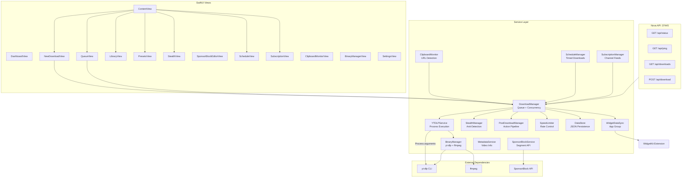

# ytdlp-gui

A modern macOS GUI for yt-dlp with full option coverage, anti-detection capabilities, download scheduling, channel subscriptions, and a glassmorphic SwiftUI interface.


---

## Features

| Feature | Description |
|---------|-------------|
| 160+ yt-dlp flags | Visual editor across 17 categories -- every option accessible without a terminal |
| Download queue | Configurable concurrency (1-10 simultaneous), pause/resume/cancel per item |
| Playlist detection | Auto-detect YouTube playlists, browse entries, selective download |
| Format selector | Visual picker with quality comparison and quick presets (Best Video, Audio MP3/FLAC, 1080p, 720p) |
| Anti-detection suite | User agent rotation (50+ agents), random delays, TLS impersonation, proxy rotation, cookie import (Chrome/Firefox/Safari/Edge/Brave), player client rotation, PO token support, auto-retry on 429/403 |
| Download library | Persistent history with thumbnails, search, filtering, favorites, one-click re-download |
| Presets | Built-in and custom download presets including Stealth Mode |
| Clipboard monitor | Watches clipboard for video URLs, offers instant download |
| Scheduled downloads | Time-based downloads with repeating rules (daily, weekly) |
| Channel subscriptions | Subscribe to channels/playlists for automatic new-content downloads |
| SponsorBlock editor | Visual timeline editor to remove sponsor segments before download |
| Post-download actions | Move, convert, tag, run scripts, or open in app after download |
| Speed limiter | Global or per-download speed caps with presets |
| Binary management | Auto-detect yt-dlp and ffmpeg, one-click updates |
| Desktop widget | WidgetKit extension (Small / Medium / Large) with live download queue and daily stats |
| Log viewer | Color-coded real-time yt-dlp output |
| Nova API server | HTTP API on port 37445 (loopback only) |

---

## Architecture



---

## Installation

1. Install yt-dlp: `brew install yt-dlp`
2. Install ffmpeg (recommended): `brew install ffmpeg`
3. Download the latest DMG from [Releases](https://github.com/kochj23/ytdlp-gui/releases)
4. Open the DMG and drag ytdlp-gui.app to `/Applications`
5. No sandbox -- direct file system access

## Requirements

| Requirement | Minimum |
|-------------|---------|
| macOS | 14.0 (Sonoma) |
| Architecture | Universal (Apple Silicon + Intel) |
| yt-dlp | Required -- `brew install yt-dlp` |
| ffmpeg | Recommended for format merging -- `brew install ffmpeg` |

---

## Building

```bash
git clone https://github.com/kochj23/ytdlp-gui.git
cd ytdlp-gui
xcodebuild -project ytdlp-gui.xcodeproj -scheme ytdlp-gui -configuration Release build
```

## Testing

```bash
xcodebuild test -project ytdlp-gui.xcodeproj -scheme ytdlp-gui \
  -destination 'platform=macOS' -only-testing:ytdlp-guiTests \
  CODE_SIGN_IDENTITY="" CODE_SIGNING_REQUIRED=NO CODE_SIGNING_ALLOWED=NO
```

300 tests across 41 test classes covering unit, functional, security, and integration layers:

| Category | Tests | What's Covered |
|----------|------:|----------------|
| Unit: Options | 24 | `YTDLPOptions.toArguments()` for all 17 flag categories, Codable round-trip |
| Unit: Models | 56 | DownloadItem, DownloadProgress, DownloadPreset, LibraryItem, FormatInfo, PostDownloadAction, SponsorBlockSegment, AppSettings, StealthProfile, CookieSource, OutputTemplate |
| Unit: URL Detection | 21 | Clipboard URL pattern matching for 19 supported sites |
| Unit: YouTube ID | 9 | Video ID extraction from watch, youtu.be, shorts URLs |
| Unit: Progress Parsing | 9 | Regex extraction of percentage, speed, ETA, total size |
| Unit: Byte/Time Parsing | 12 | GiB/MiB/KiB/GB/MB/KB/B size strings, HH:MM:SS and MM:SS |
| Unit: Metadata | 7 | MediaMetadata/PlaylistInfo JSON decoding, FormatInfo codec/resolution |
| Unit: Enums | 6 | AudioFormat, MergeOutputFormat, SubtitleFormat, Impersonate, SponsorBlock, Fixup |
| Unit: Error | 11 | YTDLPError descriptions, equality, HTTP 429/403 detection patterns |
| Unit: Channels/Schedule | various | ChannelSubscription, ScheduledDownload, DownloadResult Codable |
| Functional: Stealth | 5 | User agent pool rotation, exhaustion reset, uniqueness |
| Functional: Speed | 6 | SpeedLimiter formatting, presets |
| Security: Injection | 6 | Shell metacharacter safety, proxy/UA injection, direct script execution |
| Security: Filenames | 3 | restrict-filenames, windows-filenames, trim-filenames |
| Security: URL/Creds | 4 | SponsorBlock API encoding, notification domain-only, no hardcoded passwords |
| Integration: Binary | 4 | yt-dlp, ffmpeg, ffprobe availability, Application Support directory |
| Frame | various | App launch, view instantiation, settings/stealth round-trip |

---

## Nova API Server

Port **37445** (127.0.0.1 loopback only). No authentication required.

| Method | Path | Description |
|--------|------|-------------|
| `GET` | `/api/status` | App status, version, uptime |
| `GET` | `/api/ping` | Health check |
| `GET` | `/api/downloads` | Current download queue |
| `POST` | `/api/download` | Start a download (`{"url":"..."}`) |

```bash
curl -s http://127.0.0.1:37445/api/status | python3 -m json.tool
```

---

## License

MIT License -- Copyright (c) 2026 Jordan Koch

See [LICENSE](LICENSE) for the full text.

---

Written by Jordan Koch
